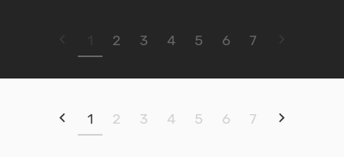

# svelte-easy-paginate

A Svelte plugin for paginating your data in no time.

<h2 align="center">
  
  <br>
</h2>

## Installation

```bash
npm install -D svelte-easy-paginate
```

## Usage

```html
<script>
  import { paginate, PaginationNav } from 'svelte-easy-paginate'

  let items = [...]
  let currentPage = 1
  let pageSize = 4
  $: paginatedItems = paginate({ items, pageSize, currentPage })
</script>

<ul class="items">
  {#each paginatedItems as item}
    <li class="item">
      {item}
    </li>
  {/each}
</ul>

<PaginationNav
  totalItems="{items.length}"
  pageSize="{pageSize}"
  currentPage="{currentPage}"
  limit="{1}"
  showStepOptions="{true}"
  on:setPage="{(e) => currentPage = e.detail.page}"
/>
```

In this example, we're paginating the data in the `items` list. Instead of displaying the list directly, we first pass it into the `paginate` function to return a subset of the list that we should display based on the current page and the page size.

Since we've defined `paginatedItems` as a computed data, it should update the displayed paginated items whenever the `currentPage` changes.

To navigate between pages you can either create your own navigation component or use the navigation component that come with `svelte-easy-paginate` (`<PaginationNav/>`). Either way, you just need a way to update `currentPage`.

## `<PaginationNav/>`

For this component to work, it needs to know:
- `totalItems`: the total number of the original list (unpaginated list).
- `pageSize`: the number of items displayed per page.
- `currentPage`: the currently selected page.

This will display all page links in the navigation. If you want to limit the maximum number of the displayed links, use the `limit` prop.

## `limit`

This prop takes a number that specifies how many items to display on each side. If you give it `1`, for example, your nav will look like this:

```
1 … 4 5 6 … 13
```

In this case, `5` is the active page, and it has one page on each side, `4` and `6`.

Let's see another example. This is how it will look if `limit = 2`:

```
1 … 4 5 6 7 8 … 13
```

In this example, `6` is the active page, and it has two pages on each side.

You can disable `limit` by setting it to `null`, which is the default value.

## `showStepOptions`

If you set this prop to `true`, it will display the previous and next arrows on the navigation.

## Customizing the options of the navigation component

You can also change the content of each option type through slots. For example, if you want to display page numbers using this format: `Page: {pageNumber}`, you can do this:

```html
<PaginationNav
  ...
  let:value="{pageNumber}"
>
  <span slot="number">
    Page: {pageNumber}
  </span>
</PaginationNav>
```

So using the `number` slot with its `value`, you can update how page numbers are displayed. Here's a list for the other option types:

- Ellipsis: `<span slot="ellipsis">`
- Previous: `<span slot="prev">`
- Next: `<span slot="next">`


## License

[MIT](http://opensource.org/licenses/MIT)

